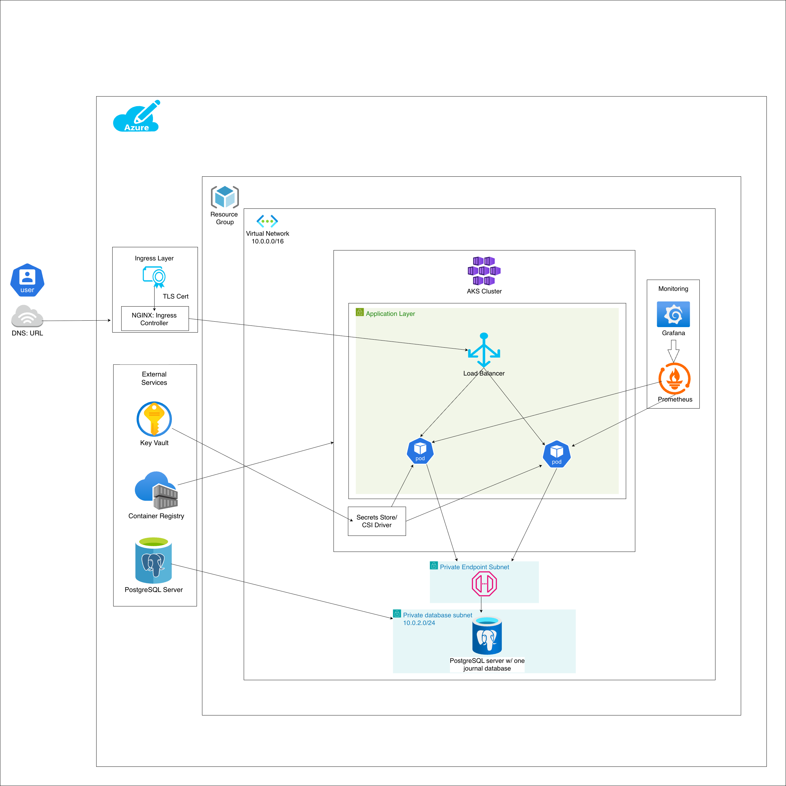

# Journal API

Welcome to my forked Learn to Cloud repository to deploy a journal API.  Here you will find everything nessecary to deploy this web FastAPI kubernetes cluster to Azure cloud using IaC. This project deployes a FastAPI + PostgreSQL application for tracking daily learning progress, deployed on Azure Kubernetes Service (AKS). Some key services this project uses in Azure are Key Vault, Azure Container Registry, Azure Kubernetes Cluster, Virtual Network, PostgreSQL server/database, and Azure OpenAI. Please remember to study, apply, and learn but most importantly have fun!

Thanks!

## 📖 Table of Contents

- [Overview](#overview)
- [Architecture](#architecture)
- [Prerequisites](#prerequisites)
- [Local Development](#local-development)
- [Cloud Deployment](#cloud-deployment)
- [API Reference](#api-reference)
- [Troubleshooting](#troubleshooting)
- [Contributing](#contributing)
- [License](#license)

## 🚀 Overview

This project is a journal API that creates, reads, updates, and deletes daily entries into an Azure cloud PostgreSQL database. The Azure OpenAI analyzes the entries added to this database for sentiment, summaries, and topic extraction.

## 🏗️ Architecture



**Components:**
| Component | Description |
|-----------|-------------|
| AKS | Kubernetes cluster running the Journal API pods |
| ACR | Container registry storing Docker images |
| Azure PostgreSQL | Managed database for journal entries |
| Key Vault | Secure storage for secrets and credentials |
| Azure OpenAI | AI service for journal entry analysis |

## Prerequisites

### 💻 For Local Development
- Git
- Docker Desktop
- VS Code with Dev Containers extension

### ☁️ For Cloud Deployment
- Azure CLI (`az`)
- kubectl
- Terraform
- Helm 3
- GitHub CLI (`gh` and/or `git`)

## 💻 Local Development

See the [Capstone Development Guide](docs/capstone-guide.md) for detailed local development instructions.

**Quick Start:**

```bash
# Clone the repository
git clone https://github.com/YOUR_USERNAME/journal-starter.git
cd journal-starter

# Copy environment template
cp .env-sample .env

# Open in VS Code and reopen in Dev Container
code .

# Start the API (inside dev container)
./start.sh

# Visit http://localhost:8000/docs
```

## ☁️ Cloud Deployment

### Step 1: Deploy Azure Infrastructure

```bash
cd infra
terraform init
terraform plan
terraform apply
```

This creates:
- Resource Group
- AKS Cluster
- Azure Container Registry
- Azure Key Vault
- Azure PostgreSQL Flexible Server

### Step 2: Configure GitHub Actions

Follow the [GitHub-Azure Connection Guide](docs/github-azure-connection.md) to set up:
- Service Principal for GitHub Actions
- ACR credentials
- Key Vault secrets

### Step 3: Deploy to AKS

```bash
# Connect to AKS
az aks get-credentials --resource-group <rg-name> --name <aks-cluster-name>

# Deploy Kubernetes resources
kubectl apply -f k8s/
```

See [k8s/README.md](k8s/README.md) for detailed Kubernetes deployment instructions.

### Step 4: Set Up Monitoring (Optional)

```bash
kubectl apply -f k8s/monitoring/
```

See [k8s/monitoring/README.md](k8s/monitoring/README.md) for Prometheus and Grafana setup.

## API Reference

| Endpoint | Method | Description |
|----------|--------|-------------|
| `/health` | GET | Health check |
| `/entries` | GET | List all entries |
| `/entries` | POST | Create a new entry |
| `/entries/{id}` | GET | Get a specific entry |
| `/entries/{id}` | PUT | Update an entry |
| `/entries/{id}` | DELETE | Delete an entry |
| `/entries/{id}/analyze` | POST | AI analysis of an entry |

**Interactive API docs:** `http://<your-api-url>/docs`

## Troubleshooting

### Local Development Issues

| Problem | Solution |
|---------|----------|
| Dev container won't start | Ensure Docker Desktop is running. Try `Dev Containers: Rebuild Container` |
| Can't connect to database | Check `.env` has correct `DATABASE_URL`. Run `docker ps` to verify PostgreSQL is running |
| API won't start | Run `./start.sh` from the project root inside the dev container |
| Tests failing | Run `uv sync --all-extras` first. Check error messages for missing implementations |

### Cloud Deployment Issues

| Problem | Solution |
|---------|----------|
| `ImagePullBackOff` | Verify ACR credentials. Run `az aks check-acr` to test connectivity |
| Pods stuck in `Pending` | Check node resources. Run `kubectl describe pod <pod-name>` |
| Secrets not mounting | Verify Key Vault CSI driver is enabled. Check SecretProviderClass config |
| No external IP | Wait a few minutes. Check `kubectl describe svc journal-api` for events |
| 502 Bad Gateway | Check pod health with `kubectl logs`. Verify `/health` endpoint works |

### GitHub Actions Issues

| Problem | Solution |
|---------|----------|
| Authentication failed | Regenerate `AZURE_CREDENTIALS`. Verify service principal has correct permissions |
| ACR push failed | Check `ACR_USERNAME` and `ACR_PASSWORD` are correct |
| AKS deployment failed | Verify `AKS_CLUSTER_NAME` and `AZURE_RESOURCE_GROUP` match your infrastructure |

## Documentation

| Document | Description |
|----------|-------------|
| [Capstone Guide](docs/capstone-guide.md) | Local development tasks and workflow |
| [GitHub-Azure Connection](docs/github-azure-connection.md) | CI/CD setup instructions |
| [Kubernetes Deployment](k8s/README.md) | AKS deployment guide |
| [Monitoring Setup](k8s/monitoring/README.md) | Prometheus and Grafana |
| [Explore Database](docs/explore-database.md) | PostgreSQL query guide |

## Contributing

1. Fork the repository
2. Create a feature branch: `git checkout -b feature/your-feature`
3. Make your changes and add tests
4. Run tests: `uv run pytest`
5. Run linter: `uv run ruff check api/`
6. Commit: `git commit -m "Add your feature"`
7. Push: `git push origin feature/your-feature`
8. Open a Pull Request

## License

MIT License - see [LICENSE](LICENSE) for details.
